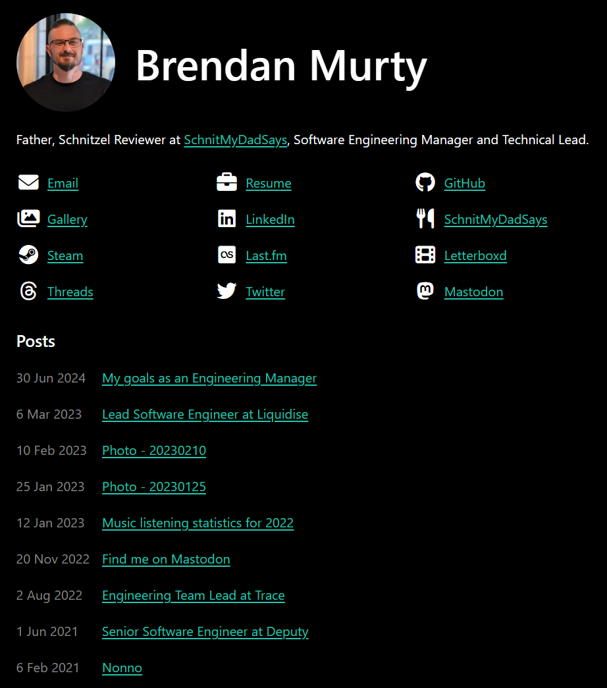
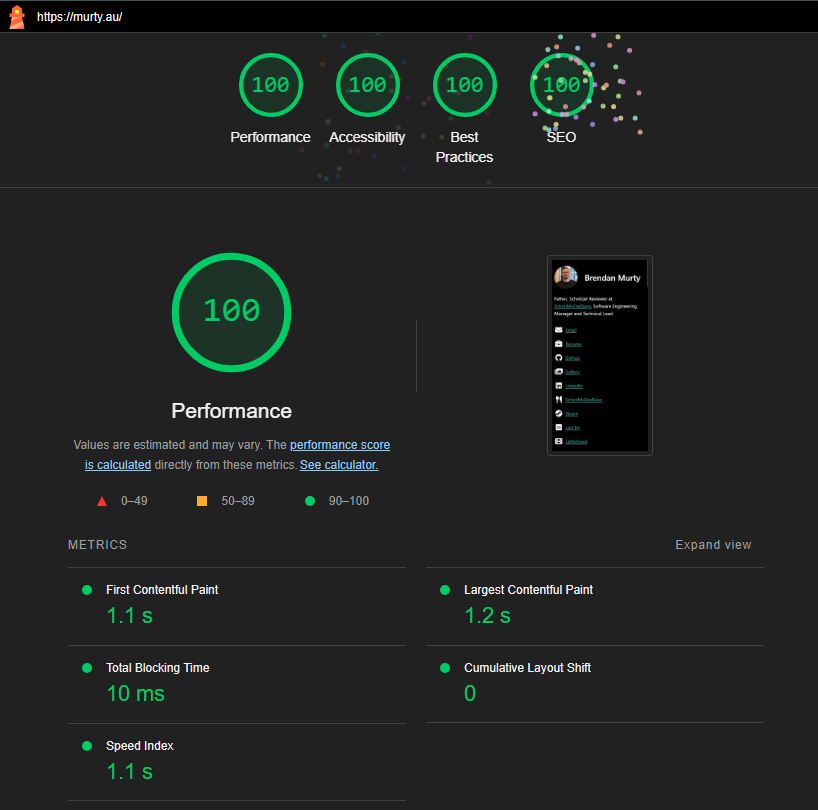

# murty.au

## Summary

This repository contains the website for the [Murty family](https://murty.au/), which has been built with [Deno](https://deno.land/), [Lume](https://lumeland.github.io/), and the free icon pack from [Font Awesome](https://fontawesome.com/).

Development, tests, build and deployment processes are handled locally and the resulting static site is hosted by [GitHub Pages](https://pages.github.com/) from the `public` directory.

### Preview of the home page



### Lighthouse performance results



## Initial Setup

1. Fork this repository
2. Make a local clone of that forked repository
3. Update some files in the forked repository:

- The `bin/deploy.sh` script must be updated to use your forked repository URLs when updating `CHANGELOG.md`
- All files in the `content` directory should contain your own content instead
- All files in the `assets` directory should contain your own static files instead

4. Commit and push all of these changes to your forked repository
5. Setup [GitHub Pages](https://pages.github.com/) for your forked repository:

- Repository settings > Pages > Source: _GitHub Actions_
- Repository settings > Pages > Custom domain: _use your own domain_
- Update the `CNAME` file to use this same domain

6. Install [Deno](https://deno.land/)
7. Run [bin/setup.sh](bin/setup.sh) to complete the initial installation process: `deno task setup`
8. Update your `.env` file:

- `GOOGLE_ANALYTICS_SITE_CODE`: The related site code from your [Google Analytics](https://analytics.google.com/) account

9. Install [exiftool](https://exiftool.org/) on your local machine
10. **Optional:** Install [VS Code](https://code.visualstudio.com/) and the recommended plugins:

- [Deno](https://marketplace.visualstudio.com/items?itemName=denoland.vscode-deno)
- [Prettier](https://marketplace.visualstudio.com/items?itemName=esbenp.prettier-vscode)

## Commands

### Run Tests

```
deno task test
```

### Build Site

```
deno task build
```

### Local Web Server

```
deno task serve
```

### Deployment

After testing locally, run [bin/deploy.sh](bin/deploy.sh) to make a new version, build it in the `public` directory, and deploy it via [GitHub Pages](https://pages.github.com/):

```
deno task deploy YYYY.xxx
```

Where `YYYY` is the current year, and `xxx` is the revision number for that year.

This script will:

- Update the content in [CHANGELOG.md](CHANGELOG.md)
- Create a new Git Tag (`YYYY.xxx` as detailed above)
- Push changes up to the origin repository
- Build the site
- Trigger GitHub Pages to deploy a new version of the site
