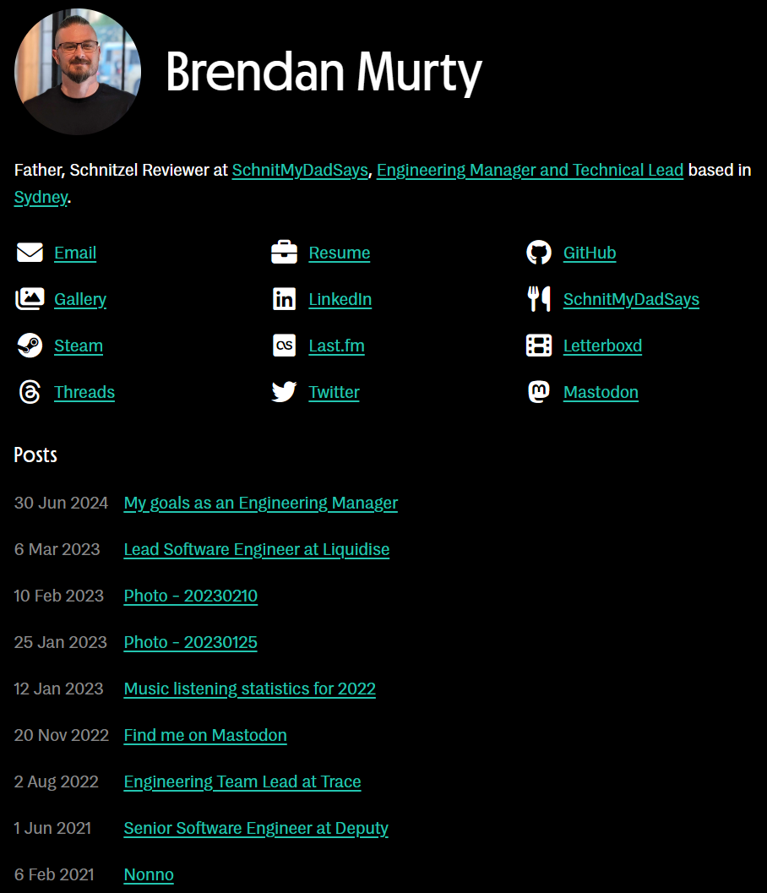
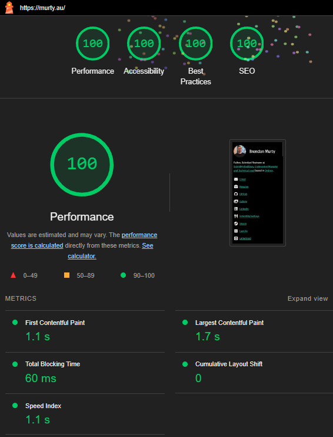

# Murty Website

## Summary

This repository contains the website for the [Murty family](https://murty.au/), which has been built with [Deno](https://deno.land/), [Lume](https://lumeland.github.io/), fonts that I've purchased from [Mass-Driver](https://mass-driver.com/), and the free icon pack from [Font Awesome](https://fontawesome.com/).

Tests, build and local server commands are available from local environments.

Remote testing and [GitHub Pages](https://pages.github.com/) deployment can be triggered locally and is then handled remotely by a GitHub Actions workflow in [.github/workflows/deployment.yml](.github/workflows/deployment.yml).

The GitHub Actions workflow also pushes a new version of the built site to the [murty-website](https://hub.docker.com/r/brendanmurty/murty-website) repository on Docker Hub.

### Preview of the home page

### Lighthouse performance results

## Folder structure and key files

- [.github/workflows/deployment.yml](.github/workflows/deployment.yml) - Triggers when a release tag is pushed, runs tests, deploys to [GitHub Pages](https://pages.github.com/) and publishes a new [release](https://github.com/brendanmurty/murty-website/releases)
- [.vscode](.vscode/) - Customised [VS Code](https://code.visualstudio.com/) configuration for this repository
- [assets](assets/) - Static files like images and PDFs
- [content](content/) - Website page content in [Markdown](https://daringfireball.net/projects/markdown/syntax) files
- [scripts](scripts/) - Helper scripts, refer to the `Commands` section below for more details
- [src](src/) - Source code, templates and CSS files
- [deno.json](deno.json) - [Deno](https://deno.land/) imports, tasks and configuration for this repository
- [Dockerfile](Dockerfile) - [Docker](https://www.docker.com/) configuration file to allow the site to build and serve inside a minimal Linux container

## Initial setup

1. Fork this repository
2. Make a local clone of that forked repository
3. Update some files in the forked repository:

- Update `.github/workflows/deployment.yml` to use your forked GitHub repository URL
- Update `.github/workflows/deployment.yml` to use your own Docker Hub repository URL
- All files in the `content` directory should contain your own content instead
- All files in the `assets` directory should contain your own static files instead
- Purchase your own license to use [Mass-Driver](https://mass-driver.com/) fonts or use other fonts

4. Commit and push all of these changes to your forked repository
5. Update the Settings for your forked repository via GitHub:

- Pages > Source: _GitHub Actions_
- Pages > Custom domain: _use your own domain_
- Secrets and variables > Actions > new secret > Name: `DOCKERHUB_USERNAME`, Secret: _your Docker username_
- Secrets and variables > Actions > new secret > Name: `DOCKERHUB_TOKEN`, Secret: _[generate new token](https://app.docker.com/settings/personal-access-tokens), read and write permissions, save the generated token here_

6. Update the `CNAME` file in the repository to use the same domain as you configured above
7. Install [Docker Desktop](https://www.docker.com/products/docker-desktop/)
8. Install [Deno](https://docs.deno.com/runtime/manual/getting_started/installation/)
9. Update your `.env` file:

- `GOOGLE_ANALYTICS_SITE_CODE`: The related site code from your [Google Analytics](https://analytics.google.com/) account

10. **Optional:** Install [VS Code](https://code.visualstudio.com/) and the recommended plugins:

- [Deno](https://marketplace.visualstudio.com/items?itemName=denoland.vscode-deno)
- [Prettier](https://marketplace.visualstudio.com/items?itemName=esbenp.prettier-vscode)

## Commands

| Command | Description | Notes |
| ---- | ---- | ---- |
| `deno task test` | Run all tests | |
| `deno task build` | Build the site | |
| `deno task serve` | Local web server | |
| `deno task deploy YYYY.xxx` | Deploy via GitHub Actions | Where `YYYY` is the current year, and `xxx` is the revision number for that year, such as `2024.036`. This will create and push a new Git Tag and trigger the [GitHub Actions workflow](.github/workflows/deployment.yml) in the remote repository. |

_For more details here, refer to the `tasks` section in [deno.json](deno.json)._