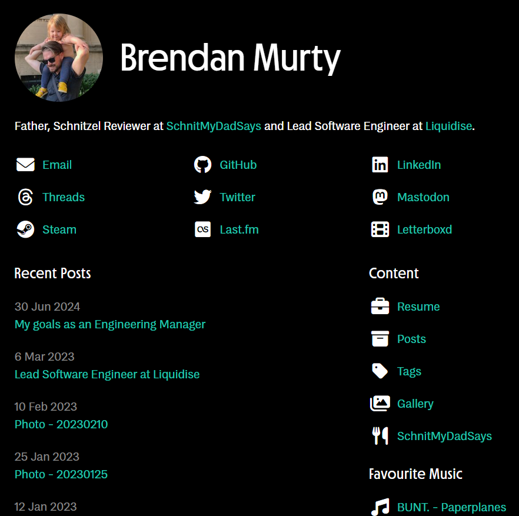

# murty.au

## Summary

This repository contains the website for the [Murty family](https://murty.au/), which has been built with [Deno](https://deno.land/), [Lume](https://lumeland.github.io/) and [Docker](https://www.docker.com/). The resulting static site is hosted by [GitHub Pages](https://pages.github.com/).

I've also used fonts that I've purchased from [Mass-Driver](https://mass-driver.com/), and the free icon pack from [Font Awesome](https://fontawesome.com/).



## Initial Setup

To setup a new local development environment:

1. Fork this repository
2. Make a local clone of that forked repository
3. Update some files in the forked repository:

- The `bin/deploy.sh` script must be updated to use your forked repository URLs when updating `CHANGELOG.md`
- All files in the `content` directory should contain your own content instead
- All files in the `assets` directory should contain your own static files instead
- Purchase your own license to use [Mass-Driver](https://mass-driver.com/) fonts or use other fonts

4. Commit and push all of these changes to your forked repository
5. Setup [GitHub Pages](https://pages.github.com/) for your forked repository:

- Set to deploy on the `main` branch for the `/docs` directory
- Add your own domain for this and update that in the `CNAME` file

6. Install [Deno](https://deno.land/)
7. Install [Docker Desktop](https://www.docker.com/products/docker-desktop/)
8. Run [bin/setup.sh](bin/setup.sh) to complete the initial installation process: `deno task setup`
9. Update your `.env` file:

- `GOOGLE_ANALYTICS_SITE_CODE`: The related site code from your [Google Analytics](https://analytics.google.com/) account
- `LASTFM_API_KEY`: Your [Last.fm API key](https://www.last.fm/api/account/create) to show your loved tracks on the site

10. Install [exiftool](https://exiftool.org/) on your local machine
11. **Optional:** Install [VS Code](https://code.visualstudio.com/) and the recommended plugins:

- [Deno](https://marketplace.visualstudio.com/items?itemName=denoland.vscode-deno)
- [Prettier](https://marketplace.visualstudio.com/items?itemName=esbenp.prettier-vscode)

## Commands

### Run Tests

Run [bin/test.sh](bin/test.sh):

```
deno task test
```

### Build Site

Run [bin/build.sh](bin/build.sh):

```
deno task build
```

### Local Web Server

```
deno task serve
```

Refer to the `tasks > serve` section in [deno.json](deno.json) for details on how this works via Docker.

### Deployment

After testing locally, run [bin/deploy.sh](bin/deploy.sh) to make a new version, build it in the `docs` directory, and deploy it via [GitHub Pages](https://pages.github.com/):

```
deno task deploy YYYY.xxx
```

Where `YYYY` is the current year, and `xxx` is the revision number for that year.

This script will:

- Update the content in [CHANGELOG.md](CHANGELOG.md)
- Create a new Git Tag (`YYYY.xxx` as detailed above)
- Push changes up to the origin repository
- Build the site
- Trigger GitHub Pages to deploy a new version of the site
