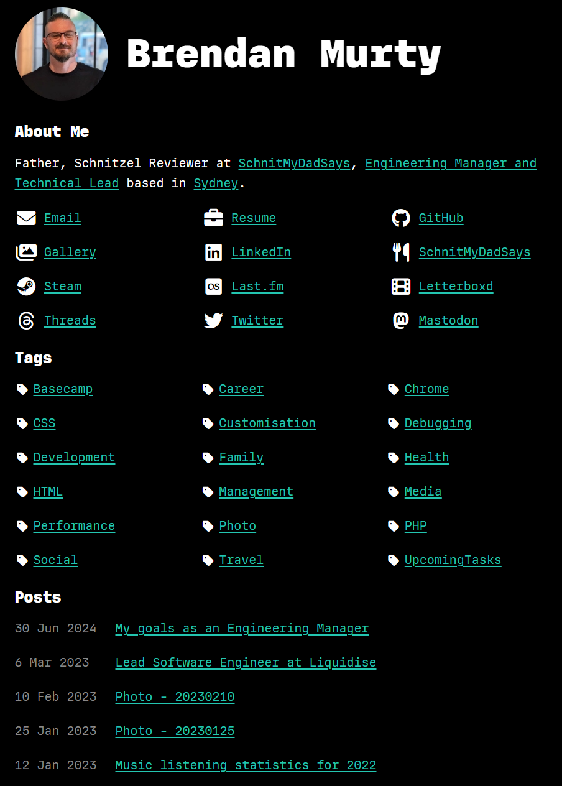
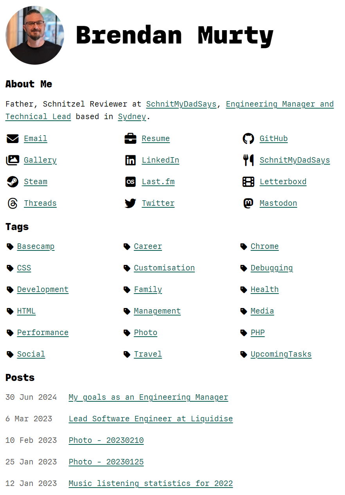
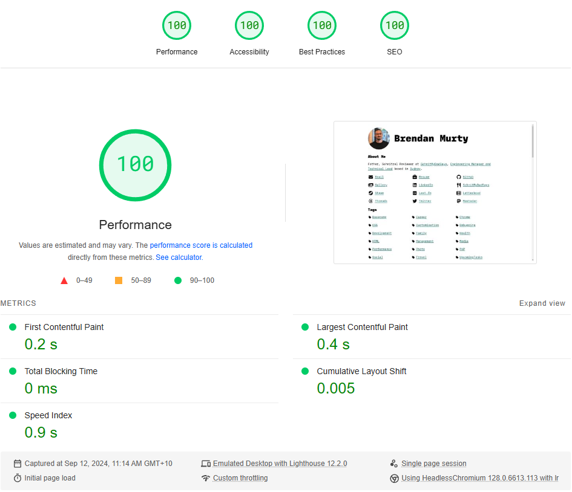

# Murty Website

## Summary

This repository contains the website for the [Murty family](https://murty.au/), which has been built with [Deno](https://deno.land/), [Lume](https://lumeland.github.io/), a commercially licensed version of the [IO font by Mass-Driver](https://io.mass-driver.com/), and a licensed icon pack from [Font Awesome](https://fontawesome.com/).

Tests, build and local server commands are available from local environments.

Remote testing and [GitHub Pages](https://pages.github.com/) deployment can be triggered locally and is then handled remotely by a [GitHub Actions workflow](.github/workflows/release.yml).

Optionally, you can use a [Dev Container](https://code.visualstudio.com/docs/devcontainers/containers) via [VS Code](https://code.visualstudio.com/) to run the development environment inside a dedicated [Docker](https://www.docker.com/) container.

### Previews of the home page

### Lighthouse performance results

## Initial setup

1. Fork this repository
2. Make a local clone of that forked repository
3. Install [Deno](https://docs.deno.com/runtime/manual/getting_started/installation/)
4. Run the setup script: `deno task setup`
5. Update some files in the forked repository

- Update `.github/workflows/release.yml` to use your forked GitHub repository URL
- Update `.github/workflows/release.yml` to use your own Docker Hub repository URL
- All files in the `content` directory **must** contain your own content instead
- All files in the `assets` directory **must** contain your own static files instead
- Purchase your own license to use the [Mass-Driver IO font](https://io.mass-driver.com/) or update the CSS to use other fonts
- Purchase [Font Awesome Pro](https://fontawesome.com/), setup your own kit, and update the `kit.fontawesome.com` script path in the source code. Alternatively, you can use a free icon pack and update the code in your fork to use that instead.

6. Commit and push all of these changes to your forked repository
7. Update the Settings for your forked repository via GitHub:

- Pages > Source: _GitHub Actions_
- Pages > Custom domain: _use your own domain_
- Secrets and variables > Actions > new secret > Name: `DOCKERHUB_USERNAME`, Secret: _your Docker username_
- Secrets and variables > Actions > new secret > Name: `DOCKERHUB_TOKEN`, Secret: _[generate new token](https://app.docker.com/settings/personal-access-tokens), read and write permissions, save the generated token here_

8. Update the `CNAME` file in the repository to use the same domain as you configured above
9. Setup [Fathom Analytics](https://usefathom.com/):

- Create your own account and setup a new site
- Update your `.env` file's `FATHOM_ANALYTICS_SITE_ID` value to use your new `Site ID`

10. **Optional:** Install [VS Code](https://code.visualstudio.com/) and the recommended plugins:

- [Deno](https://marketplace.visualstudio.com/items?itemName=denoland.vscode-deno)
- [Prettier](https://marketplace.visualstudio.com/items?itemName=esbenp.prettier-vscode)

11. **Optional:** Use a Dev Container to run the system locally:

- Install [Docker Desktop](https://www.docker.com/products/docker-desktop/)
- Install the VS Code [Dev Containers extension](https://marketplace.visualstudio.com/items?itemName=ms-vscode-remote.remote-containers)
- Start the Dev Container via the [Command Palette](https://code.visualstudio.com/docs/getstarted/userinterface#_command-palette): `Dev Containers: Rebuild Container`

## Commands

| Command | Description |
| ---- | ---- |
| `deno task test` &nbsp; &nbsp; &nbsp; &nbsp; &nbsp; &nbsp; &nbsp; &nbsp; &nbsp; &nbsp;  | Run all tests |
| `deno task serve` | Start a local web server. Builds the site and starts a local web server at `http://localhost:8000/` |
| `deno task release` | Generate and push a new Git Tag, which will then trigger the [GitHub Actions workflow](.github/workflows/release.yml) in the remote repository. |

_For more details here, refer to the `tasks` section in [deno.json](deno.json)._

## Folder structure and key files

| Folder / File | Description |
| ---- | ---- |
| [.devcontainer](.devcontainer) | [Dev Container](https://code.visualstudio.com/docs/devcontainers/containers) configuration files. |
| [.github/workflows/release.yml](.github/workflows/release.yml) | Triggers when a release tag is pushed. Runs tests, deploys to [GitHub Pages](https://pages.github.com/), publishes a new [GitHub release](https://github.com/brendanmurty/site/releases) and pushes a new version to the [repository on Docker Hub](https://hub.docker.com/r/brendanmurty/site). |
| [.vscode](.vscode/) | Customised [VS Code](https://code.visualstudio.com/) configuration for this repository. |
| [assets](assets/) | Static files like images and PDFs. |
| [content](content/) | Website page content in [Markdown](https://daringfireball.net/projects/markdown/syntax) files. |
| [src](src/) | Source code and related unit tests. |
| [src/commands](src/commands) | Deno CLI helper scripts, refer to the `Commands` section above for more details. |
| [src/layouts](src/layouts) | React TSX page layouts. |
| [src/styles](src/styles) | CSS styles. |
| [src/templates](src/templates) | Nunjucks page templates. |
| [deno.json](deno.json) | [Deno](https://deno.land/) imports, tasks and configuration for this repository. |
